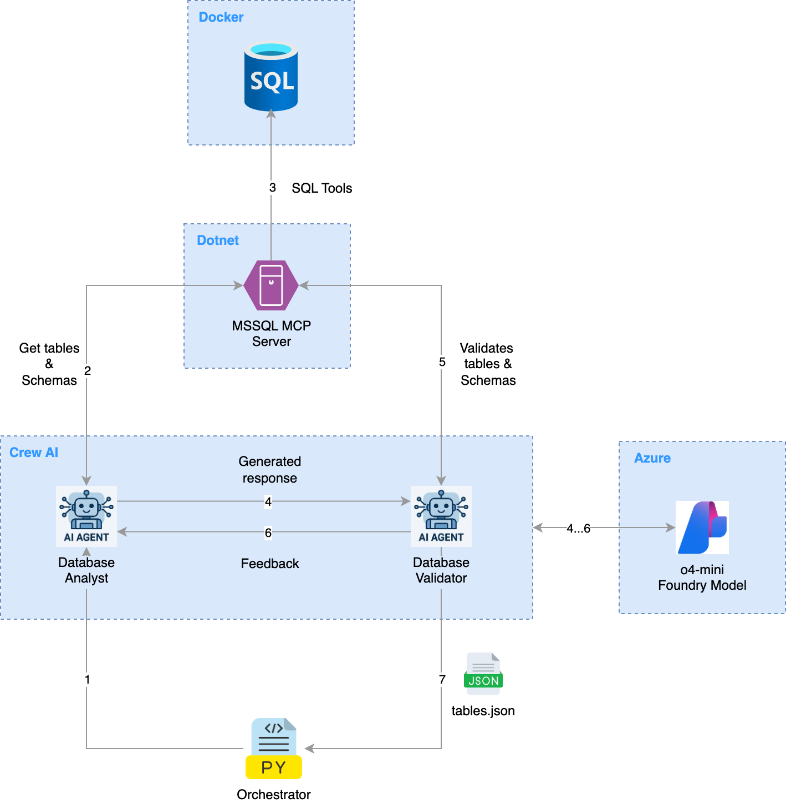

# MSSQL Synthetic Data Gen Agent
*An AI-powered agent that generates synthetic test data for Microsoft SQL Server with autonomous schema awareness.*

**MSSQL Synthetic Data Gen Agent** is an **agentic AI tool** that autonomously generates **synthetic data** for **Microsoft SQL Server** databases. It helps developers and data engineers quickly populate tables with realistic, privacy-safe data for **testing, development, and analytics**.

## 📑 Table of Contents
- [✨ Key Features](#-key-features)
- [🖥️ Environment Setup](#️-environment-setup)
- [🐍 Python Virtual Environment](#-create-a-virtual-environment-and-install-packages)
- [🛢️ Step 1: SQL Server in Docker](#️-step-1-run-sql-server-in-docker-on-macos-and-set-up-the-source-db)
- [⚙️ Step 2: MCP Server for SQL Server](#️-step-2-setup-a-mcp-server-for-sql-server)
- [🗂️ Step 3: Fetch Table Names from Database](#️-step-3-fetch-table-names-from-database)

## ✨ Key Features
- AI-driven **autonomous data generation**
- Supports **MS SQL Server** tables and schemas
- Generates **synthetic, realistic, and safe** data

## 🖥️ Environment Setup

Development is done on macOS using the tools below. Install them with Homebrew.

- Cursor 1.5.5
- Git 2.39.5
- Python 3.11.13
- Docker Desktop
- Azure Data Studio
- unixODBC
- msodbcsql18 
- mssql-tools

Install Microsoft’s ODBC driver and tools by tapping Microsoft’s Homebrew repo:

```bash
brew tap microsoft/mssql-release https://github.com/Microsoft/homebrew-mssql-release
brew update
HOMEBREW_NO_ENV_FILTERING=1 ACCEPT_EULA=Y brew install unixodbc msodbcsql18 mssql-tools
odbcinst -q -d -n "ODBC Driver 18 for SQL Server" 
brew install --cask docker
brew install --cask azure-data-studio
```

If a Python virtual environment already exists, reinstall `pyodbc` inside it:

```bash
pip uninstall pyodbc -y
pip install pyodbc --no-binary :all:
```

## 🐍 Create a virtual environment and install packages

Review [requirements.txt](./requirements.txt) and run the commands below:

```bash
python -m venv .venv
source .venv/bin/activate
python -m pip install --upgrade pip
python -m pip install -r requirements.txt
```

To deactivate, run `deactivate`.

## 🛢️ Step 1: Run SQL Server in Docker on macOS and set up the source DB

Follow these steps to set up a lightweight SQL Server environment on macOS:

1. Pull the lightweight SQL Edge image
   ```bash
   docker pull mcr.microsoft.com/azure-sql-edge
   ```

2. Run the SQL container
   ```bash
   docker run -e "ACCEPT_EULA=1" \
           -e "MSSQL_SA_PASSWORD=XXXXXX" \
           -e "MSSQL_PID=Developer" \
           -p 1433:1433 \
           -d --name sql \
           mcr.microsoft.com/azure-sql-edge
   ```

   - ACCEPT_EULA=1 → Accepts the SQL Server license.
   - MSSQL_SA_PASSWORD → Sets the SA (system administrator) password (must meet complexity rules).
   - MSSQL_PID=Developer → Runs Developer Edition (full feature set for dev/test).
   - -p 1433:1433 → Exposes SQL Server on port 1433.

> Note: For this PoC, we use a sample `MovieReviews` database to test the overall flow. This database is created by the script in the next step.

3. Run the SQL generator Python script
   ```bash
   python 01-source-db-setup/source_data_generator.py
   ```

--

## ⚙️ Step 2: Setup a MCP Server for SQL Server

Download Microsoft SQL MCP Server (Dotnet version) from [Azure SQL AI Samples](https://github.com/Azure-Samples/SQL-AI-samples/tree/main/MssqlMcp) into `02-mcp-server` folder.

NOTE:
- Updated `02-mcp-server/MssqlMcp/McsqlMcp.csproj` file with <TargetFramework> version to `net9.0`
- Removed few unwanted files (like .gitignore, .editorconfig etc. ) from the source Git repo.

Install Dotnet SDK 9
```bash
brew install --cask dotnet-sdk
dotnet --version
```

Build the MCP Server.
```bash
cd 02-mcp-server/MssqlMcp
dotnet restore
dotnet build
```

Verify `MssqlMcp.dll` should be created under `02-mcp-server/MssqlMcp/bin/Debug/net9.0/`.

## 🗂️ Step 3: Fetch Table Names from Database

Run the schema analyzer script:
```bash
python 03-sql-table-analyzer-agent/main.py
```

The agent will:
- Connect to the running MCP Server.
- Use the Database Analyst Agent to extract table names and schemas.
- Use the Validator Agent to verify the correctness of the extracted schema.
- Save the results to tables.json.

Example output:
```json
[
   { "schema": "dbo", "table": "Genres" },
   { "schema": "dbo", "table": "Movies" },
   { "schema": "dbo", "table": "Reviews" }
]
```

Validation Output:
```json
{
  "validation_passed": true,
  "issues": [],
  "message": "All expected tables and schema definitions exist with proper primary and foreign key constraints."
}
```

If validation fails, the agent automatically retries (up to 3 times) using feedback from the Validator to improve the analysis.



## 🗂️ Step 4: Fetch Schema from Database

Run the schema analyzer script:
```bash
python 04-sql-schema-analyzer-agent/main.py
```

The agent will:
- Connect to the running MCP Server.
- Use the Database Analyst Agent to extract column information.
- Use the Validator Agent to verify the correctness of the extracted column information.
- Save the results to tablename_schema.json.

Example output:
```json
[
  {
    "table_name": "Genres",
    "column_name": "GenreID",
    "data_type": "int",
    "length": "4",
    "is_primary_key": "true",
    "is_nullable": "false"
  },
  {
    "table_name": "Genres",
    "column_name": "GenreName",
    "data_type": "nvarchar",
    "length": "200",
    "is_primary_key": "false",
    "is_nullable": "false"
  }
]
```

Validation Output:
```json
{
  "validation_passed": true,
  "issues": [],
  "message": "All expected column information exist and are valid for Genres table of MovieReviews."
}
```

If validation fails, the agent automatically retries (up to 3 times) using feedback from the Validator to improve the analysis.


## 🗂️ Step 5: Fetch Relationships from Database

Run the schema analyzer script:
```bash
python 05-sql-relationship-analyzer-agent/main.py
```

The agent will:
- Connect to the running MCP Server.
- Use the Database Analyst Agent to extract relationships.
- Use the Validator Agent to verify the correctness of the extracted relationsships.
- Save the results to tablename_relationships.json.

Example output:
```json
[
  {
    "name": "FK__Movies__GenreID__3B75D760",
    "table": "Movies",
    "column": "GenreID",
    "ref_table": "Genres",
    "ref_column": "GenreID"
  },
  {
    "name": "FK__Reviews__MovieID__3F466844",
    "table": "Reviews",
    "column": "MovieID",
    "ref_table": "Movies",
    "ref_column": "MovieID"
  }
]
```

Validation Output:
```json
{
  "validation_passed": true,
  "issues": [],
  "message": "All expected foreign key relationships exist and are valid for MovieReviews."
}
```

If validation fails, the agent automatically retries (up to 3 times) using feedback from the Validator to improve the analysis.
